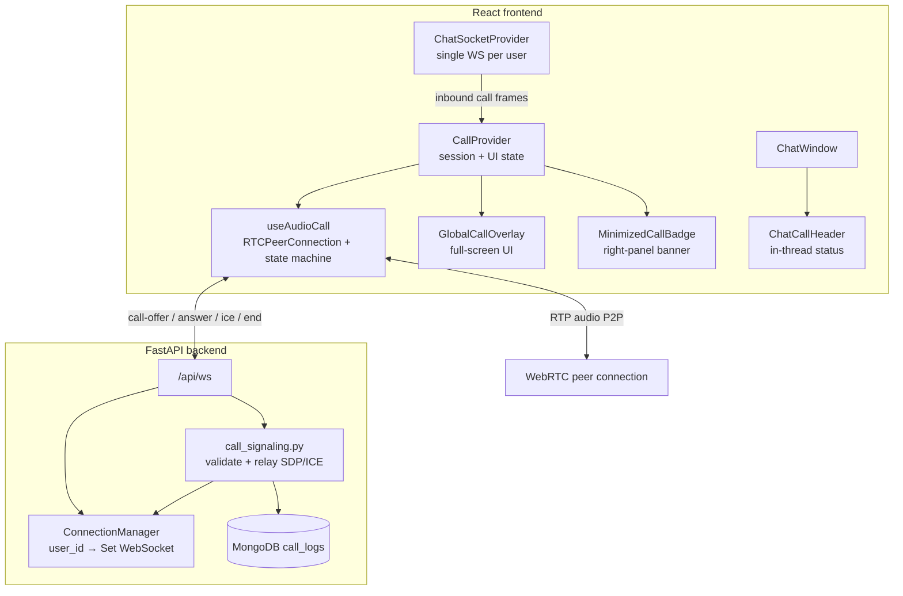

# ChatFlow

Real-time chat app with strict **Admin / Employee / Client** role-based access control.
Accounts are provisioned by administrators only — no self sign-up, no public password
reset, phone-number-based authentication, full audit trail of sensitive actions.

---

## Highlights

- **No public registration.** Admins (and delegated employees) create accounts.
- **Phone-based login** (`+91…`). Phone numbers are unique per user.
- **Delegated account creation** — admins may grant individual employees temporary
  or permanent permission to create client accounts.
- **Admin-only password resets** — no “Forgot password” for employees or clients.
- **Audit logs** — sign-ins, account creation, password resets and permission
  changes are persisted with actor, target and timestamp.
- **Show/hide password** toggles on every password field.
- Real-time messaging (WebSocket), uploads (S3), admin monitoring, batches, and diet plans.
- **Per-user chat preferences** — pin, archive, and mute conversations (WhatsApp-style long-press selection on mobile).
- **Contact profiles & shared media** — avatar quick view, full profile pages, and Media / Documents / Links tabs.
- **Client medical profiles** — conditions, medications, and notes; visible to assigned employees and admins.
- **Complaints** — clients raise issues against their employee; admins triage from the panel (open / solved).
- **Push notifications** — Firebase Cloud Messaging (FCM) on web (service worker) and Android (native tray + actions); muted chats skip FCM.
- **1:1 audio calling (WebRTC)** — voice calls between conversation participants; global WebSocket signaling so incoming calls reach any screen; full-screen overlay with minimize-to-chat badge and in-thread call header (see [architecture reference](#audio-calling-webrtc--architecture-reference)).
- **Foreground message banner** — in-app dropdown when a new message arrives while the app is open (positioned below the status bar on native).
- **Single-session login** — one active device per account; logging in elsewhere signs out the previous session and clears push tokens.
- **Shared folders** — admins/employees create folders with media, documents, and links; role-gated view/edit access.
- **WhatsApp-style chat media** — inline video thumbnails with a single custom play control; full-screen in-app photo/video viewers; documents open via native “Open with” (no in-app PDF viewer).
- **Video poster API** — server-generated thumbnails at `GET /api/media/thumbnail/{file_id}` with client-side frame capture fallback.
- **ChatFlow device folders (Android)** — downloaded chat media saved under `Download/ChatFlow/` (`frontend/src/utils/fileSystem.js`).
- **In-app Privacy Policy** — full-screen scrollable policy from **About** (all portals); no external browser.
- **i18n** — English, Hindi, and Telugu via `react-i18next` (language picker in the top-bar menu).
- **Client referrals** — employees and clients submit referrals from the top-bar menu; admins triage in **Referrals** (pending / converted / rejected).
- **Admin reports** — search users, view JSON summaries, download client/employee PDFs (`reports_api.py`, `AdminReportsPane.jsx`).
- **Android share intent** — share photos/files from other apps into a ChatFlow conversation or shared folder (`ShareIntentProvider`, native `ChatFlowShare` plugin).
- **Login history** — recent sign-in sessions in Profile settings; revoke remote devices without logging out locally (`LoginHistorySection.jsx`).
- **Role-aware mobile shells** — fixed ChatFlow header; client/employee footers (**Chats · My Diet · Folders** / **Chats · Folders**); employee batch filter in the chat sidebar; **Settings** via top-bar **⋮** menu; native back-button handling.
- **Production on AWS EC2** — Nginx + PM2 + MongoDB Atlas + S3 + DuckDNS HTTPS (documented below); optional Render/Vercel path also supported.

---

## Chat & mobile UX

### Conversation list (`ChatSidebar`)

- **Pin / Archive / Mute** — stored per user in `conversation_preferences`; list responses include `is_pinned`, `is_archived`, `is_muted` and pinned chats sort first.
- **Long-press selection (mobile)** — long-press a row to enter selection mode:
  - The **search bar slot only** swaps to an emerald action bar: **←** clear, **“1 selected”**, and **Pin / Mute / Archive**.
  - The **ChatFlow top bar** and **bottom navigation** stay visible (unchanged shell).
  - Selected rows get a subtle emerald highlight.
  - **Haptic feedback** on long-press via `@capacitor/haptics` (`frontend/src/lib/selectionHaptics.js`).
- **Hardware / system back** — when a row is selected, back clears selection before closing a chat or leaving the list (`useDoubleBackToExit` in `ChatApp` / `AdminDashboard`).
- **Archived view** — toggle to browse archived chats; search applies within the active list.
- **List scroll preservation** — scroll position is saved/restored across navigation (`frontend/src/lib/chatListScroll.js`).
- No per-row ⋯ menus on the conversation list (actions are selection-only).

### Chat thread (`ChatWindow`)

- **Date dividers** — Today / Yesterday / `DD/MM/YYYY` (`frontend/src/lib/chatDateGroups.js`).
- **Scroll-to-bottom** floating button when scrolled up.
- **Typing indicator** — shows `typing...` only.
- **In-chat search** — find messages with highlighted matches.
- **Starred messages** — star/unstar persisted per user in `starred_messages`; in-chat panel via `StarredMessagesPanel.jsx` (`messageActionsApi.js`).
- **Message edit** — long-press → Edit on your own text messages (`PATCH /api/messages/{message_id}`).
- **Audio call** — phone icon in header for 1:1 threads; compact call status row while connected (`ChatCallHeader.jsx`).
- **Header tap** — opens the contact **User profile** page (mute toggle + shared media). Call controls sit outside the profile tap target so End/Decline does not open the profile.

### Chat media (images, video, documents)

| Type | Inline bubble | Tap action |
| ---- | ------------- | ---------- |
| **Image** | Thumbnail in bubble | Full-screen `ChatImageViewer` (pinch-zoom, editor sidebar) |
| **Video** | Poster image + single center play icon; timestamp + ticks bottom-right (`ChatVideoBlock.jsx`) | Full-screen `ChatVideoViewer` (auto-play, tap to pause, bottom seek bar) |
| **Document** | File name + size row | Native “Open with” via `@capacitor-community/file-opener` (`openDocumentInNativeApp`) |
| **Audio** | WhatsApp-style voice row (`VoiceNotePlayer`) | In-bubble playback |

- **No duplicate play icons** — inline video bubbles use `` posters only; native `<video>` controls are suppressed (`controls={false}` + WebKit CSS in `index.css`).
- **Poster pipeline** — local upload preview → API thumbnail → client frame capture (`useVideoPoster.js`, `videoThumbnailUrl.js`).
- **Downloads** — optional cache + progress ring for large files (`useChatMediaDownload.js`, `chatMediaCache.js`); videos with in-app playback skip download UI when `onOpenInAppMedia` is wired.

### About, legal & support

- **About sheet** — bottom sheet from the top-bar **⋮ → About** (`AboutSheet.jsx`); app version, features, credits from `frontend/src/lib/appInfo.js`.
- **Privacy Policy** — in-app full-screen page (`PrivacyPolicyScreen.jsx`); content in `privacyPolicyContent.js`; back returns to About.
- **Contact Support** — `mailto:` link using `SUPPORT_EMAIL` from `appInfo.js` (override with `REACT_APP_SUPPORT_EMAIL`).

### Profiles & shared media

- **Avatar tap** (list or thread) — `ProfileQuickView` sheet.
- **Full profile** — `/chat/contact/:userId` (client/employee) or `/admin/contact/:userId` (`UserProfilePage.jsx`) with mute control and `SharedMediaSection` (Media / Documents / Links).
- **Public user API** — `GET /api/users/{user_id}/public` for safe contact fields.

### Top bar & admin panel

- App title is always **ChatFlow** (not “Admin | Overview”, etc.).
- **Refresh** in the three-dots menu re-fetches conversations, messages, and cache (no logout).
- **Admin → Users** filter: All | Employees | Clients | Inactive Clients.
- **Mobile footer** — Home · Chats · Contacts · Settings (More hub); unread badge on **Chats**, not the logo.
- **Mobile “More” hub** — Monitor chats, Batches, Folders, Reports, Permissions, Referrals, Complaints, Storage (desktop sidebar also has Activity audit, Inactive clients, Accounts).
- **Complaints inbox** — filter all / open / solved; mark solved or reopen.
- **Storage** — admin view of upload usage; delete conversations or user accounts from the panel.
- **Medical profile** — edit client medical data from user detail (`/admin/users/...` flows).

### Shared folders (`/chat/folders`)

- **Browse** — clients and employees open role-filtered folders from the **Folders** footer tab (`FolderBrowsePage.jsx`).
- **Manage** — admins use **Admin → Folders**; employees create folders scoped to their clients (`AdminFoldersPane.jsx`, `folders_api.py`).
- **Categories** — links, photos, videos, documents with role-based access rules (all clients, active only, specific user, etc.).
- **Share into folder** — Android share intent can target a folder (`ShareDestinationSheet.jsx`).

### Mobile footers (`PanelBottomNav`)

| Role     | Footer tabs                         | Settings / profile      |
| -------- | ----------------------------------- | ----------------------- |
| Client   | Chats · My Diet · Folders           | Top bar **⋮** menu      |
| Employee | Chats · Folders                     | Top bar **⋮** menu      |
| Admin    | Home · Chats · Contacts · Settings  | **More** hub + sidebar  |

Employee **batch filter** lives in the chat sidebar (not the footer). Footers hide only when a **conversation thread** is open, not during list selection.

### Client diet

- **My Diet** opens `DietPlanPage` from **Day 1** (`startFromDayOne` on `DietPlanContent`).
- Employees/admins manage multi-day plans, meal slots, photo uploads, and notes per client (`DietPlanContent.jsx`).

### Client complaints & medical

- **Raise a complaint** — clients use **Profile → Raise a complaint** (`RaiseComplaintPage.jsx`); stored with status `open` / `solved`.
- **Submit a referral** — employees/clients use **⋮ → Refer a client**; admins convert pending referrals to accounts in **Referrals**.
- **Medical profile** — `MedicalProfilePage.jsx` for clients; employees/admins view via user account detail and admin user tools.
- **Login history** — **Profile → Login history** lists recent devices; revoke old sessions remotely.

### Notifications

| Surface | Behavior |
| -------- | -------- |
| **Web (PWA)** | Service worker (`frontend/public/sw.js`) shows tray notifications from FCM data payloads when the tab is backgrounded. |
| **Android (native)** | FCM → `ChatFlowMessagingService` — grouped per sender, reply/mark-read actions, coalesced threads; not duplicated by the web SW. |
| **Foreground** | `InAppMessageBanner.jsx` — tap to open the conversation; swipe to dismiss; auto-hides after ~4.5s. |
| **Muted chats** | FCM is **skipped** when `conversation_preferences.is_muted` is true for that user. |
| **Active chat** | Tray + banner suppressed while viewing the same conversation (native prefs + `optimisticMessages.js`). |
| **Toasts** | Sonner toasts for errors/success; top offset uses `--app-safe-area-top` so banners sit below the OS status bar on Android (`safeAreaInsets.js`). |

Token registration: `POST /api/users/me/fcm-token` after login on native (`PushNotificationBootstrap.jsx`).

---

## Audio calling (WebRTC) — architecture reference

1:1 **audio-only** calls between two participants in a direct (non-group) conversation.
This section is the **full infrastructure map** for understanding, implementing, or porting the feature.

### High-level architecture



**Design principle:** signaling rides the **existing chat WebSocket**, relayed by **`user_id`** (global socket registry), **not** by conversation room. The callee receives incoming calls on **any screen** (chat, settings, diet plan, admin panel).

### Provider stack (mount order matters)

```
AuthProvider
  └─ ChatSocketProvider          ← one WebSocket, sendSignal(), ensureHealthy()
       └─ CallProvider            ← activeCallSession, useAudioCall, remote <audio>
            ├─ GlobalCallBridge   ← confirms listener is live (no UI)
            ├─ GlobalCallOverlay  ← full-screen call UI (all routes)
            └─ BrowserRouter
                 └─ GlobalCallBackground  ← auto-minimize on route change
                      └─ ChatProvider     ← activeConversationId for badge logic
                           └─ routes / ChatApp / ChatPanelLayout
                                └─ MinimizedCallBadge (right panel only)
```

Reference: [`frontend/src/App.js`](./frontend/src/App.js).

### Call state machine (frontend)

| State | Meaning | UI |
| ----- | ------- | -- |
| `idle` | No active call | Phone icon in chat header |
| `outgoing` | Caller sent offer, waiting for answer | Full-screen “Calling…” |
| `incoming` | Callee received offer/ring | Full-screen Accept / Decline |
| `connecting` | SDP answer exchanged, ICE in progress | “Connecting…” |
| `connected` | `RTCPeerConnection` connected | Overlay + timer + Mute/Speaker/Chat/End |
| `disconnected` / `failed` | Teardown | Overlay closes, badge hides |

Constants: [`frontend/src/lib/callConstants.js`](./frontend/src/lib/callConstants.js) (`CALL_STATE`, `CALL_SIGNAL`).

### Signaling protocol

**Client → server** (same WebSocket as chat; payload includes `type`):

| type | payload | notes |
| ---- | ------- | ----- |
| `call-offer` | `{ call_id, conversation_id, target_user_id, sdp }` | Caller initiates; server validates both users are conversation participants |
| `call-answer` | `{ call_id, sdp }` | Callee answers |
| `ice-candidate` | `{ call_id, candidate }` | Trickle ICE |
| `call-decline` | `{ call_id, reason? }` | Callee rejects |
| `call-end` | `{ call_id, reason? }` | Either side hangs up |

**Server → client** (relayed to peer’s global sockets):

| type | when |
| ---- | ---- |
| `call-offer` | Forwarded to callee with `caller_id`, `caller_name`, `sdp` |
| `call-ring` | UI hint to callee (metadata only) |
| `call-ringing` | Ack to caller that offer reached server |
| `call-answer` | SDP answer forwarded to caller |
| `ice-candidate` | ICE forwarded to peer |
| `call-decline` / `call-end` / `call-ended` | Teardown both sides |
| `call-error` | e.g. `forbidden`, `invalid_offer` (calls are **not** blocked when callee has no WebSocket — caller still gets `call-ringing`) |

Backend relay: [`backend/call_signaling.py`](./backend/call_signaling.py).  
WS hook in [`backend/server.py`](./backend/server.py) — inbound frames whose `type` starts with `call-`, plus `ice-candidate`, dispatch to `handle_call_signal()`.

### Complete file inventory

**Backend**

| File | Role |
| ---- | ---- |
| `backend/call_signaling.py` | Validates participants, in-memory call registry, relays SDP/ICE, writes `call_logs` |
| `backend/server.py` | `ConnectionManager` (`user_id → Set[WebSocket]`), WS endpoint, `GET /api/call-history/me`, `GET /api/admin/call-logs` |

**Frontend — core**

| File | Role |
| ---- | ---- |
| `context/CallContext.jsx` | Orchestration: session, inbound signal queue, UI minimize, navigation ref |
| `context/ChatSocketContext.jsx` | Wraps `useChatSocket`; exposes `sendSignal`, `ensureHealthy`, `reconnect` |
| `hooks/useAudioCall.js` | `RTCPeerConnection`, mic stream, mute, state machine, ICE buffering |
| `hooks/useChatSocket.js` | WS connect, routes `CALL_INBOUND_TYPES` to `callSignalListenerRef`; `4401` auth close triggers session re-check |
| `components/ForceLogoutBridge.jsx` | Single-session poll + WS auth-failure handler |
| `lib/callConstants.js` | States, signal types, ICE servers, SDP normalization |
| `lib/callSignalBridge.js` | Sync ref `{ current: onCallSignalReceived }` — avoids useEffect race |
| `lib/callSignalingLog.js` | Debug logging (`ws.inbound`, `session.incoming`, etc.) |
| `lib/callHistoryFormat.js` | Timer formatting for UI |

**Frontend — UI**

| File | Role |
| ---- | ---- |
| `components/call/GlobalCallOverlay.jsx` | WhatsApp-style full-screen call UI (incoming + connected) |
| `components/call/MinimizedCallBadge.jsx` | Green banner in **right panel only** when call minimized |
| `components/call/ChatCallHeader.jsx` | Compact “On call with …” row inside chat header |
| `components/call/callOverlay.css` | Overlay animations, dock layout, badge styles |
| `components/call/GlobalCallBridge.jsx` | Mounts `useGlobalCallListener` at app root |
| `components/call/GlobalCallBackground.jsx` | Mounts `useCallBackgroundRoute` inside Router |

**Frontend — integration hooks**

| File | Role |
| ---- | ---- |
| `hooks/useRegisterCallNavigation.js` | Registers `openConversationById` so Accept/Chat navigate to thread |
| `hooks/useGlobalCallListener.js` | Confirms shell listener is registered per user session |
| `hooks/useCallBackgroundRoute.js` | Auto-minimize overlay when leaving call thread (audio keeps running) |
| `components/ChatWindow.jsx` | Phone icon, `ChatCallHeader`, `startCallForChat()` |
| `pages/ChatApp.jsx` | `useRegisterCallNavigation`, badge on admin `<main>` |
| `components/layout/ChatPanelLayout.jsx` | Badge in employee/client right panel |

**Frontend — history / admin (optional)**

| File | Role |
| ---- | ---- |
| `pages/CallHistoryPage.jsx` | Employee/client call history |
| `components/call/CallHistoryList.jsx` | Shared list UI |
| `components/admin/AdminCallLogsPane.jsx` | Admin call log tab |

### UI behavior matrix

| Scenario | What shows |
| -------- | ---------- |
| Outgoing / incoming (not minimized) | `GlobalCallOverlay` full-screen |
| Connected, overlay open | Overlay with Mute · Speaker · Chat · End dock |
| Connected, user taps Chat | `returnToCallChat()` → minimize overlay, navigate to thread, show badge |
| Connected, viewing **that** call’s thread | `ChatCallHeader` only — **no** floating badge |
| Connected, viewing **different** chat / settings / diet | `MinimizedCallBadge` at top of **right panel** (not over sidebar) |
| Mobile `/chat` home (no sidebar) | Badge fixed below TopBar |
| Call ended | Overlay + badge disappear instantly |

### WebSocket requirements (critical for reliability)

1. **Single backend instance** on the WS port — multiple uvicorn workers each have their own in-memory `ConnectionManager`; caller and callee can land on different instances and never see each other’s frames.
2. **`ensureHealthy()` before placing a call** — ping/pong on the socket; stale sockets after `uvicorn --reload` must reconnect.
3. **Global `user_id` registry** — `send_to_user(target_user_id, event)` delivers to **all** open tabs for that user.
4. **Presence snapshot on connect** — when a tab opens `/api/ws`, the server sends `presence` events for every user already in `ConnectionManager.active` (fixes “offline” on fresh tabs).
5. **Live `online` in REST responses** — conversation/user APIs set `online` from `has_active_connection()` (same check as call routing), not stale DB flags alone.
6. **Inbound routing** — `useChatSocket` checks `CALL_INBOUND_TYPES` and invokes `callSignalListenerRef.current` **synchronously** (set by `CallProvider`, not via React effect).
7. **Signal queue** — both `call-offer` and `call-ring` are queued; dropping either breaks incoming calls.
8. **Activity fallback** — incoming messages/typing mark the sender online in the UI when presence events were missed.

### Backend: ConnectionManager pattern

```python
# server.py — user_id -> Set[WebSocket], NOT conversation rooms
class ConnectionManager:
    async def send_to_user(self, user_id: str, event: dict) -> int: ...
    def connection_count(self, user_id: str) -> int: ...
```

Call signaling **never** joins a “conversation room”. The server looks up the callee’s `user_id` and forwards to every registered socket.

### MongoDB `call_logs` collection

Written by `call_signaling.py` on offer / answer / decline / end:

```json
{
  "call_id": "uuid",
  "conversation_id": "...",
  "caller_id": "...",
  "callee_id": "...",
  "started_at": "ISO8601",
  "answered_at": "ISO8601 | null",
  "ended_at": "ISO8601 | null",
  "duration_seconds": 123,
  "status": "missed | answered | declined"
}
```

REST: `GET /api/call-history/me`, `GET /api/admin/call-logs?user_id=...`

### Environment / media

| Variable | Purpose |
| -------- | ------- |
| `REACT_APP_ICE_SERVERS` | Optional JSON array of ICE servers (TURN for strict NAT). Default: Google STUN |
| HTTPS or `localhost` | Required for `navigator.mediaDevices.getUserMedia()` |

### User flow (end-to-end)

1. User taps **phone** in 1:1 chat header → `startCallForChat(conversationId, remoteUserId, remoteName)`.
2. `useAudioCall.startCall()` → `ensureHealthy()` → get mic → create offer → `sendSignal('call-offer', ...)`.
3. Server validates participants → relays to callee → sends `call-ringing` to caller.
4. Callee: `GlobalCallOverlay` shows incoming; Accept → `acceptCall()` → answer SDP → navigate to thread.
5. ICE trickle → `connectionState === 'connected'` → timer starts.
6. Minimize: Chat button or route change → overlay hides, badge shows (unless already in that thread).
7. End: `endActiveCall('hangup')` → `call-end` signaling → cleanup tracks + reset session.

### Local testing

1. Start **one** backend on port **`8002`** and frontend on `3000` (browser dev ignores production `.env` URLs and uses `hostname:8002` — see `frontend/src/lib/backendUrl.js`).
2. Optional: copy `frontend/.env.local` with `REACT_APP_BACKEND_URL=http://localhost:8002` if you need explicit overrides.
3. Hard-refresh **both** browser sessions (normal + incognito). Log in as **two different users** in a direct conversation — not the same account twice (single-session login invalidates the other tab’s WebSocket).
4. Place a call; watch backend logs:
   ```
   call_signal call-offer accepted: call_id=... callee_id=... online (N socket(s))
   ```
5. Automated smoke test (backend must be running on `8002`):
   ```bash
   python scripts/test_call_signaling_local.py
   ```
6. If callee never rings — check WS connected (`WS connected: user_id=...` in backend logs). If you see `WS reject: inactive session`, log out and back in on that tab.
7. Browser console: look for `ws.health.ok`, `session.incoming`, `audio.incoming`.

**Mute during a call:** toggles `MediaStreamTrack.enabled` on the local mic (`useAudioCall.toggleMute`); hard-refresh after code changes.

### Known pitfalls

| Symptom | Cause | Fix |
| ------- | ----- | --- |
| Caller stuck on “Calling…”, callee sees nothing | Multiple uvicorn processes / stale WS / callee not connected | Single instance; both users logged in with WS up; `ensureHealthy()` + reconnect |
| Contact shows offline while messaging | Missed presence event or stale DB flag | Hard refresh; presence snapshot on connect; message/typing marks sender online |
| `WS reject: inactive session` loop | Stale JWT after login elsewhere or superseded session | Log out/in; `ForceLogoutBridge` + `chatflow:ws_auth_failed` handler |
| Callee gets ring but no SDP | Only `call-ring` processed, offer dropped | Queue **all** inbound call frames |
| Call button works but no ring on other side | Callee has 0 WebSockets (app closed / bad session) | Callee must open app; offer is still accepted server-side for caller |
| Badge overlaps sidebar | Badge mounted at app root with `fixed` full width | Mount inside right-panel `position: relative` container |
| Duplicate call UI in thread | Badge + `ChatCallHeader` both visible | Hide badge when `activeConversationId === callConversationId` |
| `useEffect` registration race | Listener registered after first WS frame | Use sync ref (`callSignalListenerRef`) |
| Mute button does nothing | Inverted track.enabled logic (fixed in `useAudioCall`) | Hard refresh frontend |

### Limitations (v1)

- Direct (1:1) chats only — group calls rejected server-side.
- In-memory `_active_calls` dict — use Redis + TTL for multi-worker production.
- Speaker toggle is UI-only on web (no browser speaker routing API).
- Audio only — no video tracks.

---

## Mobile app (Capacitor)

Native shells live under `frontend/android` and `frontend/ios` (Capacitor 8).

- **Install:** JavaScript dependencies (including `@capacitor/*`) install only under **`frontend/`**. From that directory run `npm install` before `npm start` or `npm run build`; otherwise Webpack reports “Can't resolve '@capacitor/…'”.
- **Build and sync:** from `frontend/`, run `npm run build:mobile` (CRA build + `npx cap copy` + `npx cap sync`). Debug APK: `npm run android:assemble`.
- **Open in IDEs:** `npm run cap:android` or `npm run cap:ios` (iOS requires macOS with Xcode).
- **App name and bundle id:** edit `frontend/capacitor.config.json` (`appName`, `appId`). Defaults: **ChatFlow** and **`com.chatflow.app`**. Change `appId` if you need something like `com.user.myapp`; after changing it, run `npx cap sync` and fix signing in Android Studio / Xcode.
- **Branded splash:** `SplashScreenBootstrap.jsx` shows ChatFlow icon + wordmark for at least 3s on native while auth loads; Capacitor splash is hidden as soon as React paints.
- **API URL resolution** (`frontend/src/lib/backendUrl.js`):
  - **Native:** `REACT_APP_BACKEND_URL_MOBILE` or `REACT_APP_BASE_URL` (must be a LAN IP or public HTTPS URL — never `localhost`).
  - **Browser on AWS (DuckDNS / EC2):** same origin as the page; REST calls go to `/api` via Nginx (no `:8000` in the URL).
  - **Browser dev:** same host as CRA, port **`8002`** (override with `REACT_APP_DEV_BACKEND_PORT`).
- **Auth:** JWT in `Authorization` header + `X-ChatFlow-Browser-Id` on web and native (not HttpOnly cookies — avoids WebView CORS and multi-tab cookie races). `nativeAuthSync.js` mirrors the token into Android shared prefs for FCM handlers.
- **CORS for the native shell:** include `http://localhost`, `capacitor://localhost`, and `ionic://localhost` in backend `CORS_ORIGINS` for production APKs talking to a public API.
- **Push:** `@capacitor/push-notifications` registers FCM tokens; custom `ChatFlowNative` plugin tracks active chat and notification sounds on Android (`frontend/android/.../ChatFlowNativePlugin.java`).
- **Share intent (Android):** custom `ChatFlowShare` plugin receives shares from other apps; `ShareIntentProvider` routes to a conversation or shared folder (`frontend/src/lib/shareIntent/`).
- **Firebase:** place `firebase-adminsdk.json` in `backend/` for local dev, or set `FIREBASE_SERVICE_ACCOUNT_FILE` on the server (see `backend/.env.example`). Add `google-services.json` in the Android app per Firebase console instructions.
- **Camera and photos:** profile avatar and chat “Photo” attachments use `@capacitor/camera` (`nativeMedia.js`). iOS privacy strings are in `frontend/ios/App/App/Info.plist`.
- **Files:** `@capacitor-community/file-opener` + `@capacitor/filesystem` for opening documents in chat (`mediaHandler.js`, `fileSystem.js`). Typed download subfolders: Images, Videos, Documents, Audio under `ChatFlow/`.
- **Quick scripts (repo root):**
  - `.\scripts\build-android.ps1` — `npm run build:mobile`, sync Capacitor, open Android Studio.
  - `.\scripts\build-android.ps1 -AssembleDebug` — same + debug APK via Gradle.
  - `.\scripts\deploy-aws.ps1` — `git push`, SSH deploy to AWS EC2 (pull, pip, PM2, frontend build, Nginx reload). Use `-SkipGitPush` to deploy only what is already on the remote. (`deploy-oci.ps1` is deprecated and forwards here.)
- **Haptics:** `@capacitor/haptics` for chat-list long-press selection (`selectionHaptics.js`). After adding or upgrading native plugins, run `npm run cap:sync` from `frontend/`.
- **Safe area:** status-bar spacer in `TopBar` / `ChatWindow`; notification banners and toasts use `notification-viewport-top` + `initSafeAreaInsets()` so they clear the Android status bar when `env(safe-area-inset-top)` is `0`.
- **System back:** `useDoubleBackToExit.js` traps back at the app root and delegates drill-up (clear selection → close chat → admin sub-panels) before normal history.
- **Capacitor CLI** 8.x may warn that **Node 22+** is expected; upgrade Node if `npx cap` misbehaves.

---

## Authentication flow

```
┌──────────────┐         POST /api/auth/login        ┌────────────────┐
│  Login page  │  ─── { phone_number, password } ──► │  FastAPI       │
│ (phone + pw) │  ◄── { access_token, user } ─────── │  /api          │
└──────────────┘                                      └────────────────┘
```

- All other routes re-validate via `Authorization: Bearer` + `X-ChatFlow-Browser-Id` (JWT `bid` claim must match).
- **Web:** JWT stored in `sessionStorage` (per tab); optional `localStorage` when “Stay signed in” is enabled (`frontend/src/lib/api.js`).
- **Native (Capacitor):** same Bearer + browser-id headers; `nativeAuthSync.js` mirrors token for FCM handlers.
- WebSocket upgrade: `GET /api/ws?token=...&bid=...` (query params — WS cannot read axios headers).
- **Single-session login** — a new sign-in deactivates prior `sessions` rows, sends `force_logout` on the old WebSocket, and clears old FCM tokens; users can review/revoke history at `/api/auth/login-history`.
- **Session health:** `ForceLogoutBridge` polls `/api/auth/session/validate` and reacts to WS close code `4401` (inactive session).
- There are **no** `/auth/register` or public `/auth/forgot-password` endpoints.

---

## Role-based access control (RBAC)

| Capability                          | Admin | Employee (with permission) | Employee | Client |
| ----------------------------------- | :---: | :------------------------: | :------: | :----: |
| Sign in                             |  ✅   |             ✅             |    ✅    |   ✅   |
| Change own password                 |  ✅   |             ✅             |    ✅    |   ✅   |
| Create **employee** accounts        |  ✅   |             ❌             |    ❌    |   ❌   |
| Create **client** accounts          |  ✅   |             ✅             |    ❌    |   ❌   |
| Reset another user’s password       |  ✅   |             ❌             |    ❌    |   ❌   |
| Grant/revoke account-creation perm. |  ✅   |             ❌             |    ❌    |   ❌   |
| View audit logs                     |  ✅   |             ❌             |    ❌    |   ❌   |
| Monitor all conversations           |  ✅   |             ❌             |    ❌    |   ❌   |

Enforcement lives in FastAPI dependencies:

- `require_admin` — blocks non-admin requests.
- `require_account_creator` — admin OR an employee with `account_creation_access`.

---

## Database schema

### `users`
| Field                       | Type         | Notes                                                  |
| --------------------------- | ------------ | ------------------------------------------------------ |
| `id`                        | string (uuid)| Primary key.                                           |
| `username`                  | string       | Unique, lowercase. Auto-generated if not provided.     |
| `phone_number`              | string (E.164) | **Unique**, required. Used for login.                |
| `full_name`                 | string       | Display name.                                          |
| `password_hash`             | string       | bcrypt.                                                |
| `role`                      | string       | `admin` \| `employee` \| `client`.                     |
| `account_creation_access`   | bool         | When `true`, an employee can create client accounts.   |
| `created_by`                | string\|null | `users.id` of the actor that created this account.     |
| `password_reset_by`         | string\|null | `users.id` of the last admin to reset this password.   |
| `password_reset_at`         | iso datetime | Last admin password reset.                             |
| `permissions_updated_by`    | string\|null | Last admin to toggle this user’s permissions.          |
| `permissions_updated_at`    | iso datetime | When permissions were last changed.                    |
| `employee_id` (clients)     | string       | Owning employee.                                       |
| `batch_id` (clients)        | string       | Batch the client belongs to.                           |
| `bio`, `avatar_url`, `status`, `online`, `last_seen`, `created_at` | …  | Existing chat profile fields. |

Indexes: `username` (unique), `phone_number` (unique).

### `audit_logs`
| Field            | Type         |
| ---------------- | ------------ |
| `id`             | string (uuid)|
| `actor_user_id`  | string\|null |
| `action`         | string (namespaced: `account.create`, `password.admin_reset`, `permissions.account_creation.grant`, `permissions.account_creation.revoke`, `auth.login`, `auth.login_failed`, `auth.logout`, `password.self_change`) |
| `target_user_id` | string\|null |
| `metadata`       | object       |
| `timestamp`      | iso datetime |

Indexes: `timestamp DESC`, `actor_user_id`, `target_user_id`, `action`.

### `conversation_preferences`
Per-user, per-conversation settings (not global for the thread).

| Field              | Type   | Notes                                      |
| ------------------ | ------ | ------------------------------------------ |
| `id`               | string | `{user_id}_{conversation_id}`              |
| `user_id`          | string | Viewer who owns this preference row.       |
| `conversation_id`  | string | Conversation UUID.                         |
| `is_pinned`        | bool   | Pinned chats appear first in the list.     |
| `is_archived`      | bool   | Hidden from main list; archived view only. |
| `is_muted`         | bool   | Suppresses FCM for that conversation.      |
| `updated_at`       | iso    | Last change.                               |

Index: `(user_id, conversation_id)` unique.

### `sessions`
Tracks active sign-in devices (single-session enforcement).

| Field           | Type         | Notes                                      |
| --------------- | ------------ | ------------------------------------------ |
| `id`            | string (uuid)| Primary key.                               |
| `user_id`       | string       | Account owner.                             |
| `token_jti`     | string       | JWT ID bound to this session.              |
| `is_active`     | bool         | `false` after logout or superseded login.  |
| `created_at`    | iso datetime | Sign-in time.                              |
| `last_active`   | iso datetime | Last activity / revoke time.               |
| `user_agent`    | string       | Optional client hint.                      |
| `ip_address`    | string       | Optional.                                  |

### `starred_messages`
Per-user starred chat messages.

| Field              | Type   | Notes                    |
| ------------------ | ------ | ------------------------ |
| `id`               | string | UUID.                    |
| `user_id`          | string | Who starred the message. |
| `message_id`       | string | Starred message.         |
| `conversation_id`  | string | Parent conversation.     |
| `starred_at`       | iso    | When starred.            |

### `referrals`
Client referrals submitted by employees/clients; admin triage.

| Field                  | Type   | Notes                                              |
| ---------------------- | ------ | -------------------------------------------------- |
| `id`                   | string | UUID.                                              |
| `referred_by_id`       | string | Submitting user.                                   |
| `referred_name/phone`  | string | Prospect contact.                                  |
| `health_goal`          | string | e.g. `weight_loss`, `muscle_gain`, …               |
| `status`               | string | `pending` \| `converted` \| `rejected`             |
| `converted_client_id`  | string | Set when converted to a client account.            |
| `created_at`           | iso    | Submission time.                                   |

### `call_logs`
WebRTC call history (written by `call_signaling.py`).

| Field               | Type   | Notes                                    |
| ------------------- | ------ | ---------------------------------------- |
| `call_id`           | string | UUID per call attempt.                   |
| `conversation_id`   | string | Direct (1:1) conversation.               |
| `caller_id`         | string | Initiator.                               |
| `callee_id`         | string | Recipient.                               |
| `started_at`        | iso    | Offer time.                              |
| `answered_at`       | iso    | Null if missed/declined.                 |
| `ended_at`          | iso    | Hang-up time.                            |
| `duration_seconds`  | int    | Connected duration.                      |
| `status`            | string | `missed` \| `answered` \| `declined`     |

### Migrations
On startup `_migrate_user_documents` runs:

1. **Drops the legacy unique `email` index** if present.
2. **Backfills `phone_number`** on legacy documents using a deterministic
   `+91XXXXXXXXXX` placeholder; admins should reset these afterwards via the
   admin panel.
3. Ensures `account_creation_access`, `created_by`, `password_reset_by` exist.

---

## REST API surface

### Auth
- `POST /api/auth/login` — `{ phone_number, password }` → `{ access_token, user, browser_install_id }` (deactivates prior sessions).
- `POST /api/auth/logout` — invalidates current session row; client clears stored JWT.
- `GET  /api/auth/verify` — returns the current session’s user.
- `GET  /api/auth/me` — same shape, semantic alias.
- `GET  /api/auth/session/validate` — lightweight `{ valid, reason? }` poll (foreground refresh).
- `GET  /api/auth/login-history` — alias `GET /api/users/me/sessions`; recent sign-ins with `is_current`.
- `POST /api/auth/sessions/{session_id}/revoke` — remote sign-out for a past device.

### Self
- `PUT  /api/users/me` — update `full_name`, `bio`, `status`, `avatar_url`.
- `POST /api/users/me/password` — change own password (requires current password).
- `GET  /api/me/permissions` — `{ role, account_creation_access }`.

### Account creation (admin OR permitted employee)
- `POST /api/accounts` — body `{ phone_number, password, full_name, role, username?, employee_id?, batch_id? }`.
  - Admin may create `employee` or `client`.
  - Permitted employee may create `client` only (auto-assigned to themselves).

### Admin only
- `GET  /api/admin/users`
- `GET  /api/admin/users/{id}` — includes `created_by_user` and `password_reset_by_user`.
- `POST /api/admin/users/{id}/reset-password` — `{ new_password }`.
- `POST /api/admin/users/{id}/permissions` — `{ account_creation_access: bool }`.
- `POST /api/admin/users/{id}/active` — `{ is_active?, client_status? }` (employee activate/deactivate; client active/inactive/dropped).
- `GET  /api/admin/clients` — client roster with lifecycle status.
- `GET  /api/admin/audit-logs?action=...&limit=...`
- `GET  /api/admin/stats`, `/admin/conversations`, `/admin/employees`, `/admin/batches`, `/admin/employees/{id}/batches`, `/admin/users/{id}/activity`.
- `GET  /api/admin/storage` — MongoDB + S3 usage (optional quota env vars).
- `DELETE /api/admin/conversations/{conv_id}`, `DELETE /api/admin/users/{user_id}`.

### Messaging & conversations
- `GET  /api/conversations` — each row may include `is_pinned`, `is_archived`, `is_muted` for the current user; pinned-first sort applied server-side.
- `PATCH /api/conversations/{conv_id}/preferences` — body `{ is_pinned?, is_archived?, is_muted? }` (partial update).
- `POST /api/conversations/start`, `POST /api/conversations/group`
- `GET  /api/conversations/{id}/messages`, `POST /api/conversations/{id}/read`
- `POST /api/messages`, `PATCH /api/messages/{message_id}` — edit own text messages.
- `POST /api/messages/{message_id}/star`, `DELETE /api/messages/{message_id}/star`
- `GET  /api/conversations/{chat_id}/starred` — starred messages in a thread.
- `POST /api/upload`, `GET /api/files/{id}`
- `GET  /api/media/stream` — authenticated stream for S3 uploads (incl. folder media).
- `GET  /api/media/thumbnail/{file_id}` — JPEG poster for video files (auth via Bearer header or `?token=&bid=`).
- `WS   /api/ws?token=...&bid=...` — chat events, typing, presence, **and WebRTC call signaling**

**WebSocket → client call events (server relay):**

| Event | When |
| ----- | ---- |
| `call-offer` | Forwarded to callee with `call_id`, `conversation_id`, `caller_id`, `caller_name`, `sdp` |
| `call-ring` | UI hint to callee (same metadata, no SDP) |
| `call-ringing` | Ack to caller that offer was accepted by server |
| `call-answer` | SDP answer forwarded to caller |
| `ice-candidate` | Trickle ICE to peer |
| `call-decline` / `call-end` / `call-ended` | Teardown on either side |
| `call-error` | e.g. invalid offer, forbidden (not used for “callee offline” — offers proceed and caller gets `call-ringing`) |

**Client → server signaling (same socket):**

| Event | Payload |
| ----- | ------- |
| `call-offer` | `{ call_id, conversation_id, target_user_id, sdp }` |
| `call-answer` | `{ call_id, sdp }` |
| `ice-candidate` | `{ call_id, candidate }` |
| `call-decline` / `call-end` | `{ call_id, reason? }` |

### Call history
- `GET /api/call-history/me` — current user’s call log.
- `GET /api/admin/call-logs?user_id=...` — admin call log search.

### Shared folders
- `GET  /api/folders`, `GET /api/folders/{folder_id}` — role-filtered browse (clients/employees).
- `GET/POST/PATCH/DELETE /api/employee/folders…` — employee folder CRUD + items/links/upload.
- `GET/POST/PATCH/DELETE /api/admin/folders…` — admin folder CRUD + user picker endpoints.

### Referrals
- `POST /api/referrals` — employee/client submits a referral.
- `GET  /api/admin/referrals` — admin inbox (`?status=pending|converted|rejected`).
- `GET  /api/admin/referrals/{referral_id}`, `PATCH /api/admin/referrals/{referral_id}` — triage / convert.

### Admin reports
- `GET  /api/admin/reports/search?q=…` — find users for reporting.
- `GET  /api/admin/reports/client/{user_id}`, `/employee/{user_id}` — JSON report payload.
- `GET  /api/admin/reports/client/{user_id}/pdf`, `/employee/{user_id}/pdf` — PDF download (requires ReportLab).

### Public profiles
- `GET /api/users/{user_id}/public` — contact-safe profile fields for profile pages.
- `GET /api/users/{user_id}/medical-profile` — client medical profile (role-gated).
- `PUT /api/admin/users/{user_id}/medical-profile` — admin updates client medical data.

### Diet plans
- `GET  /api/clients/{client_id}/diet-plans` — list plans for a client.
- `POST /api/clients/{client_id}/diet-plans` — create a new day/plan.
- `PUT  /api/diet-plans/{plan_id}/suggestions` — meal text suggestions.
- `PUT  /api/diet-plans/{plan_id}/meal/{slot}/photo` — upload meal photo.
- `DELETE /api/diet-plans/{plan_id}/meal/{slot}/photo` — remove meal photo.

### Complaints
- `POST /api/complaints` — client raises a complaint.
- `GET  /api/complaints/me` — client’s own complaints.
- `GET  /api/admin/complaints` — admin inbox (`?status=open|solved`).
- `PATCH /api/admin/complaints/{complaint_id}` — update status / notes.

### Push & notification actions
- `POST /api/users/me/fcm-token` — register device FCM token.
- `POST /api/notifications/mark-read`, `/notifications/direct-reply`, `/notifications/update-status` — Android notification action callbacks.

---

## Suggested folder structure

```
chatflow/
├─ scripts/
│  ├─ build-android.ps1         ← mobile build + Capacitor sync + Android Studio
│  ├─ deploy-aws.ps1            ← git push + SSH deploy to AWS EC2
│  ├─ deploy-aws.sh             ← same deploy (Git Bash / Linux / macOS)
│  ├─ check-aws-backend.sh      ← remote health probe
│  └─ test_call_signaling_local.py ← login + WS call-offer smoke test (port 8002)
├─ backend/
│  ├─ server.py                 ← routes, RBAC, audit, FCM, WebSocket manager
│  ├─ call_signaling.py         ← WebRTC signaling relay (1:1 audio)
│  ├─ diet_api.py               ← diet plan routes
│  ├─ folders_api.py            ← shared folder CRUD + access rules
│  ├─ reports_api.py            ← admin reports + PDF export
│  ├─ report_pdf.py             ← ReportLab PDF builders
│  ├─ media_thumbnails.py       ← video poster generation for /api/media/thumbnail
│  ├─ ecosystem.config.cjs      ← PM2 config for AWS EC2
│  ├─ requirements.txt
│  ├─ .env(.example)
│  ├─ uploads/                  ← local dev fallback for files
│  └─ firebase-adminsdk.json    ← local dev only (gitignored in prod)
└─ frontend/
   ├─ capacitor.config.json
   ├─ android/                   ← Capacitor Android + ChatFlow FCM / Share plugins
   ├─ ios/
   ├─ public/sw.js                ← web push service worker
   └─ src/
      ├─ App.js                      ← CallProvider, GlobalCallOverlay, ForceLogoutBridge, ShareIntentProvider
      ├─ context/
      │  ├─ AuthContext.jsx
      │  ├─ CallContext.jsx          ← activeCallSession, WebRTC orchestration
      │  ├─ ChatContext.jsx          ← activeConversationId (badge visibility)
      │  └─ ChatSocketContext.jsx    ← single global WebSocket
      ├─ hooks/
      │  ├─ useAudioCall.js          ← RTCPeerConnection + call state machine
      │  ├─ useCallBackgroundRoute.js
      │  ├─ useGlobalCallListener.js
      │  ├─ useRegisterCallNavigation.js
      │  ├─ useDoubleBackToExit.js
      │  ├─ useChatPanelNav.js       ← client/employee sidebar + footer items
      │  ├─ useChatSocket.js
      │  └─ useOptimisticMessageSend.js
      ├─ lib/
      │  ├─ api.js, backendUrl.js    ← JWT native auth; Nginx /api gateway
      │  ├─ callConstants.js, callSignalBridge.js
      │  ├─ push.js, notify.js, inAppNotifications.js
      │  ├─ notificationDisplay.js, safeAreaInsets.js
      │  ├─ nativeAuthSync.js, nativeMedia.js, mediaHandler.js
      │  ├─ forcedLogout.js, videoThumbnailUrl.js, privacyPolicyContent.js
      │  ├─ conversationPreferences.js, optimisticMessages.js, appInfo.js
      │  ├─ messageActionsApi.js, foldersApi.js, reportsApi.js
      │  ├─ shareIntent/             ← Android share-to-chat/folder pipeline
      │  └─ appRoutes.js, chatListScroll.js, sharedMedia.js, …
      ├─ utils/fileSystem.js           ← ChatFlow download folders (Capacitor)
      ├─ pages/
      │  ├─ ChatApp.jsx, AdminDashboard.jsx, Login.jsx
      │  ├─ DietPlanPage.jsx, FolderBrowsePage.jsx, MedicalProfilePage.jsx
      │  ├─ RaiseComplaintPage.jsx, ProfileSettingsPage.jsx, UserProfilePage.jsx, …
      └─ components/
         ├─ ChatSidebar.jsx, ChatWindow.jsx, TopBar.jsx
         ├─ call/GlobalCallOverlay.jsx, MinimizedCallBadge.jsx, ChatCallHeader.jsx
         ├─ AboutSheet.jsx, PrivacyPolicyScreen.jsx, LanguageSheet.jsx
         ├─ LoginHistorySection.jsx, InAppMessageBanner.jsx
         ├─ PushNotificationBootstrap.jsx, SplashScreenBootstrap.jsx
         ├─ SharedMediaSection.jsx, share/ShareIntentProvider.jsx
         ├─ admin/AdminReportsPane.jsx, AdminReferralsPane.jsx
         └─ layout/PanelBottomNav.jsx, folders/, diet/, chat/ (ChatVideoBlock, viewers/), …
```

---

## Local development

### Backend (FastAPI)

```bash
cd backend
python -m venv .venv
.venv\Scripts\Activate.ps1   # Windows PowerShell
pip install -r requirements.txt
uvicorn server:app --reload --port 8002 --host 127.0.0.1
```

Create `backend/.env` from `backend/.env.example`. Important variables:

```env
MONGO_URL="mongodb://localhost:27017"
DB_NAME="chatflow_db"
JWT_SECRET="replace-with-a-strong-secret"

ADMIN_USERNAME="admin"
ADMIN_PASSWORD="admin123"
ADMIN_PHONE="+919000000001"

MIN_PASSWORD_LENGTH=6
DEFAULT_PHONE_COUNTRY=IN

CORS_ORIGINS="http://localhost:3000,capacitor://localhost,ionic://localhost"
COOKIE_SECURE=false
COOKIE_SAMESITE=lax

# Optional — push notifications (local: place firebase-adminsdk.json in backend/)
# FIREBASE_SERVICE_ACCOUNT_FILE=

# Optional — WebRTC TURN (frontend/.env, JSON array)
# REACT_APP_ICE_SERVERS=[{"urls":"turn:your-turn-server:3478","username":"...","credential":"..."}]

# Optional — S3 uploads (recommended for production; local dev can use backend/uploads/)
# S3_BUCKET=  S3_REGION=ap-south-1  AWS_ACCESS_KEY_ID=  AWS_SECRET_ACCESS_KEY=
# S3_PUBLIC_BASE_URL=

# Optional — admin storage dashboard ring quotas
# MONGO_STORAGE_QUOTA_BYTES=536870912
# S3_STORAGE_QUOTA_BYTES=5368709120
```

On first boot the server seeds (phones must pass E.164 validation for region `IN`):

| Username    | Phone           | Password      | Role     |
| ----------- | --------------- | ------------- | -------- |
| `admin`     | `+919000000001` | `admin123`    | admin    |
| `employee1` | `+919000000011` | `employee123` | employee |
| `client1`   | `+919000000021` | `client123`   | client   |

> **Note:** Older docs used `+910000000001`-style placeholders; those fail `phonenumbers` validation. Use the `+9190000000xx` seed values above, or set `ADMIN_PHONE` in `.env` to match a valid Indian mobile number.

Sign in with the **phone number** (not the username) on the login page.

### Frontend (React / CRA)

```bash
cd frontend
npm install
npm start
```

`frontend/.env` (see [`frontend/.env.example`](./frontend/.env.example)) — **optional for local browser dev**; CRA on `localhost` auto-targets port **8002** via `backendUrl.js`. Use `frontend/.env.local` to override:

```env
REACT_APP_BACKEND_URL=http://localhost:8002
# Native APK dev on a phone (LAN IP, match uvicorn port):
REACT_APP_BACKEND_URL_MOBILE=http://192.168.1.13:8002
WDS_SOCKET_PORT=0
# Optional TURN for WebRTC behind strict NAT:
# REACT_APP_ICE_SERVERS=[{"urls":"stun:stun.l.google.com:19302"}]
```

**Provider stack at app root** (`App.js`): `AuthProvider` → `ChatSocketProvider` → `CallProvider` → `GlobalCallOverlay` → `BrowserRouter` → `GlobalCallBackground`. `MinimizedCallBadge` mounts inside the chat **right panel** (`ChatPanelLayout` / `ChatApp` `<main>`), not at app root. See [Audio calling architecture](#audio-calling-webrtc--architecture-reference) for the full map.

For a **production APK** against AWS, set both mobile and web URLs to your public HTTPS host (e.g. `https://vijay-chatflow.duckdns.org`) before `npm run build:mobile`.

---

## Security

- Passwords hashed with bcrypt (cost 12).
- JWT sessions include a per-install `bid` (browser id) — replay from another browser/install is rejected.
- Set `COOKIE_SECURE=true` + `COOKIE_SAMESITE=none` only if you re-enable HttpOnly cookie auth for cross-site deployments.
- Phone numbers validated with Google libphonenumber (E.164).
- All sensitive endpoints sit behind `require_admin` or `require_account_creator`.
- Role escalation is prevented:
  - `/accounts` creation defaults `account_creation_access=false`.
  - Employees may only create `client` accounts, only attached to themselves.
  - Admins cannot reset another admin’s password via `/admin/users/{id}/reset-password`.
- Audit logging is best-effort and never blocks the request path, but failures
  are warned in server logs.
- There is **no** public registration or password-reset surface to attack.

---

## Production deployment

Stack in all setups: **MongoDB Atlas** + **AWS S3** for uploads. Primary production is **AWS EC2** (Nginx + PM2); **Render/Vercel** is also supported below.

### Option A — AWS EC2 (production)

Typical layout: Ubuntu EC2 (`3.108.152.171`), Nginx serves the CRA `build/` and proxies `/api` → `127.0.0.1:8000`, PM2 runs Uvicorn, Atlas + S3 + Firebase for push. Public HTTPS: **https://vijay-chatflow.duckdns.org**.

| Piece | Notes |
| ----- | ----- |
| **Repo on server** | `/home/ubuntu/chatflow` |
| **Backend** | `backend/.venv`, `uvicorn` on port `8000` (localhost only) |
| **PM2** | [`backend/ecosystem.config.cjs`](./backend/ecosystem.config.cjs) — `pm2 start ecosystem.config.cjs` |
| **Frontend** | `cd frontend && npm run build` → Nginx `root` points at `build/` |
| **HTTPS** | DuckDNS + Let's Encrypt (`scripts/configure-aws-domain.sh`) |
| **CORS** | Include `https://vijay-chatflow.duckdns.org`, `http://localhost`, `capacitor://localhost`, `ionic://localhost` |
| **Firebase** | `FIREBASE_SERVICE_ACCOUNT_FILE=/home/ubuntu/chatflow/backend/firebase-adminsdk.json` |
| **SSH key** | `chatflow-aws.pem` (e.g. `OneDrive\Documents\chatflow-aws.pem`) |

**One-command deploy from Windows (after `git push`):**

```powershell
.\scripts\deploy-aws.ps1
# Optional: -SshKey "C:\path\to\chatflow-aws.pem"  -SkipGitPush
```

This SSHs to `ubuntu@3.108.152.171`, runs `git pull`, reinstalls backend deps, `pm2 restart chatflow-backend`, `npm run build` in `frontend/`, and reloads Nginx.

**Manual update (SSH into EC2):**

```bash
cd /home/ubuntu/chatflow && git pull

# Backend
cd backend && source .venv/bin/activate && pip install -r requirements.txt && deactivate
pm2 restart chatflow-backend && pm2 save

# Frontend
cd ../frontend && npm install && npm run build
sudo nginx -t && sudo systemctl reload nginx
```

After `.env` changes: `pm2 restart chatflow-backend --update-env`.

**Live instance:** https://vijay-chatflow.duckdns.org

**Browser API URL:** on DuckDNS / EC2 hosts, the app uses same-origin `/api` automatically (`backendUrl.js`). No `:8000` in the public URL.

**Mobile release:** set `REACT_APP_BACKEND_URL` and `REACT_APP_BACKEND_URL_MOBILE` to `https://vijay-chatflow.duckdns.org`, then:

```powershell
.\scripts\build-android.ps1
```

Build a signed APK/AAB in Android Studio (**Build → Generate Signed Bundle / APK**). Add your host to `capacitor.config.json` → `server.allowNavigation` if needed.

**Other scripts:** `scripts/bootstrap-aws.sh` (first-time server setup), `scripts/start-aws-backend.sh` (sync `.env` + restart PM2), `scripts/check-aws-backend.sh` (health probe), `scripts/configure-aws-domain.sh` (DuckDNS + SSL).

---

### Option B — Render / Vercel

End-to-end recipe: backend on **Render Web Service**, frontend on **Render
Static Site** (or Vercel).

#### 1. Backend — Render Web Service

| Setting              | Value                                                     |
| -------------------- | --------------------------------------------------------- |
| Environment          | `Python 3`                                                |
| Root Directory       | `backend`                                                 |
| Build Command        | `pip install -r requirements.txt`                         |
| Start Command        | `uvicorn server:app --host 0.0.0.0 --port $PORT`          |
| Health Check Path    | `/api/auth/verify` (returns 401 unauth — that's expected) |
| Instance Type        | `Starter` is enough to begin with                         |

Then in **Environment → Add Environment Variable**, paste the values from
[`backend/.env.example`](./backend/.env.example) one row at a time (or use the
"Add from .env" bulk editor). At minimum you must set:

- `MONGO_URL`, `DB_NAME`
- `JWT_SECRET` (generate with `openssl rand -hex 48`)
- `ADMIN_USERNAME`, `ADMIN_PASSWORD`, `ADMIN_PHONE`
- `CORS_ORIGINS` = comma-separated, **no spaces** after commas. Include your **web** origin and the **native shell** origins the app uses (Capacitor’s WebView still reports these even when the API is on the public internet), for example:  
  `https://chatflow.vercel.app,http://localhost,capacitor://localhost,ionic://localhost`
- `COOKIE_SECURE=true`, `COOKIE_SAMESITE=none`  (cross-site cookie over HTTPS)
- `S3_BUCKET`, `S3_REGION`, `AWS_REGION`, `AWS_ACCESS_KEY_ID`,
  `AWS_SECRET_ACCESS_KEY`, `S3_PUBLIC_BASE_URL`

> **Cookies gotcha.** Render gives the backend `*.onrender.com`. If your
> frontend lives on a *different* domain (Vercel, Render Static Site, your own
> domain) the browser treats the session cookie as cross-site, so you **must**
> use `COOKIE_SECURE=true` + `COOKIE_SAMESITE=none`. With those settings the
> cookie only works over HTTPS (which Render gives you for free).

#### 2. Frontend — Render Static Site (or Vercel)

| Setting           | Value                                |
| ----------------- | ------------------------------------ |
| Root Directory    | `frontend`                           |
| Build Command     | `yarn install && yarn build`         |
| Publish Directory | `build`                              |

Build-time environment variables (from [`frontend/.env.example`](./frontend/.env.example)):

- `REACT_APP_BACKEND_URL` = your Render backend URL, e.g. `https://chatflow-api.onrender.com`

#### 3. Capacitor — installable app on other phones

The JS bundle bakes API URLs at **build time**. Other people’s phones do **not** use your LAN IP; they must talk to the same **public HTTPS** API as production web.

1. **Environment (before `npm run build:mobile`)**  
   - Set `REACT_APP_BACKEND_URL=https://your-api.onrender.com` (no trailing slash).  
   - Set `REACT_APP_BACKEND_URL_MOBILE` to the **same** HTTPS URL (or leave it empty so the native app falls back to `REACT_APP_BACKEND_URL`).  
   Do **not** ship a release build that still points at `http://192.168.x.x`.

2. **Backend `CORS_ORIGINS`** must include the native origins listed above (`http://localhost`, `capacitor://localhost`, `ionic://localhost`) **in addition to** your hosted web app URL, or the app will fail API calls from the installed APK/IPA.

3. **Build and ship**  
   - From `frontend/`: `npm run build:mobile`, then open Android Studio / Xcode, bump version code, and build a **release** APK or AAB (Android) or archive for TestFlight / App Store (iOS).  
   - For sideloading Android, recipients install the signed APK (or you use Play Console **Internal testing**).

4. **Optional:** In [`frontend/capacitor.config.json`](./frontend/capacitor.config.json), extend `server.allowNavigation` with your API **hostname** if you open that host inside the WebView. XHR/fetch to the API does not require this.

5. **S3 / uploads:** Production uploads go to S3; ensure `S3_PUBLIC_BASE_URL` is correct and bucket policy/CORS allow your web origin if the browser loads objects directly.

After the first deploy:

1. Visit the frontend, sign in with `ADMIN_PHONE` + `ADMIN_PASSWORD` from your env.
2. Open **Profile → Change password** and set a strong password.
3. Use the admin panel to create real employee / client accounts.

---

## Porting this call feature to another project (Cursor prompt)

Copy the block below into a **new Cursor chat** in your target project. Adjust paths/stack names to match that repo.

<details>
<summary><strong>Click to expand — full Cursor implementation prompt</strong></summary>

```
Implement 1:1 WebRTC audio calling using the ChatFlow architecture below.
Adapt file paths to this project's conventions but preserve the design patterns.

## Goal
- Audio-only calls between two users in a direct (1:1) conversation
- Signaling over the EXISTING chat WebSocket (no separate call server)
- Incoming calls reach the user on ANY screen (global user_id socket routing)
- Full-screen call overlay + minimized badge + in-chat header row

## Architecture (must follow)

### Backend
1. Add `call_signaling.py` (or equivalent) that:
   - Handles WS frame types: call-offer, call-answer, ice-candidate, call-decline, call-end
   - Validates both users are participants in conversation_id (reject groups)
   - Maintains in-memory call registry: call_id → { caller_id, callee_id, conversation_id, state }
   - Relays SDP + ICE to peer via ConnectionManager.send_to_user(user_id, event)
   - On offer: forward call-offer + call-ring to callee (if connected), call-ringing to caller always
   - Do **not** reject offers when callee has 0 sockets — caller still rings; callee must connect to answer
   - Optionally persist call_logs to DB on offer/answer/decline/end

2. ConnectionManager MUST map user_id → Set[WebSocket] (global registry, NOT conversation rooms)

3. In websocket handler, dispatch call frame types to handle_call_signal()

### Frontend provider stack
AuthProvider → ChatSocketProvider → CallProvider → GlobalCallOverlay
  → BrowserRouter → GlobalCallBackground → ChatProvider → routes

CallProvider responsibilities:
- Hold activeCallSession { callId, conversationId, remoteUserId, remoteName, direction }
- Hold session { conversationId, remoteUserId, remoteName } for WebRTC hook
- callUiMinimized state + minimizeCallUi / expandCallUi / returnToCallChat
- registerNavigateToConversation(ref) for Accept/Chat navigation
- onCallSignalReceived: update session, queue ALL inbound frames, bump inboundSignalTick
- Set callSignalListenerRef.current = onCallSignalReceived SYNCHRONOUSLY (not useEffect)
- Wrap useAudioCall hook; expose startCallForChat, acceptIncomingCall, declineIncomingCall, endActiveCall
- Hidden <audio ref={remoteAudioRef} autoPlay playsInline /> for remote stream

### useAudioCall hook (WebRTC state machine)
States: idle | outgoing | incoming | connecting | connected | disconnected | failed

- startCall: ensureHealthy WS → getUserMedia(audio) → RTCPeerConnection → createOffer → send call-offer
- acceptCall: getUserMedia → createAnswer → send call-answer
- declineCall / endCall: send signaling + cleanup tracks + close PC
- Queue trickle ICE until remoteDescription set
- onicecandidate → send ice-candidate
- Inbound handler (drain queue on inboundSignalTick):
  - call-offer → setRemoteDescription, state=incoming
  - call-ring → state=incoming (metadata)
  - call-ringing → state=outgoing (caller ack)
  - call-answer → setRemoteDescription, state=connecting
  - ice-candidate → addIceCandidate (buffer if needed)
  - call-decline | call-end | call-ended → teardown
- Mute: toggle `isMuted` state and set `localAudioTrack.enabled = !isMuted` (do not double-negate track.enabled)
- Timer when connected

### useChatSocket additions
- CALL_INBOUND_TYPES Set routes to callSignalListenerRef.current
- sendSignal(type, targetUserId, payload) sends JSON on WS
- ensureHealthy(): ping/pong before calls; reconnect if stale

### UI components
1. GlobalCallOverlay — full-screen WhatsApp-style UI:
   - Incoming: Decline (red) / Accept (green)
   - Connected: avatar, timer, dock: Mute | Speaker | Chat | End (64px red)
   - Chat button calls returnToCallChat() (minimize + navigate)
   - Hidden when isMinimized

2. MinimizedCallBadge — ONLY in right panel container (position:absolute top:0):
   - Show when isMinimized && connected && NOT viewing active call's conversation
   - Hide when user is in that call's chat thread (ChatCallHeader handles it)
   - Mobile /chat home: fixed below app header
   - Tap → maximizeCall(); end button → endActiveCall

3. ChatCallHeader — inside chat window header when call active for this conversation:
   - "On call with {name}" + timer + end button
   - Clicks must not bubble to profile header

4. ChatWindow — phone icon when idle; wire startCallForChat from useCall()

### Integration hooks
- useRegisterCallNavigation(openConversationById) in chat shell
- useCallBackgroundRoute: auto-minimize when navigating away from call thread
- useGlobalCallListener at app root (GlobalCallBridge)

### Signaling constants (shared)
CALL_SIGNAL: call-offer, call-ring, call-ringing, call-answer, ice-candidate, call-decline, call-end, call-ended, call-error
CALL_STATE: idle, outgoing, incoming, connecting, connected, disconnected, failed
ICE: default stun:stun.l.google.com:19302; optional REACT_APP_ICE_SERVERS JSON

## Rules
- Do NOT use conversation-room WS routing for calls — always user_id global registry
- Do NOT register call listener in useEffect — use synchronous ref
- Queue both call-offer AND call-ring inbound frames
- ensureHealthy() before startCall
- Single backend worker for dev (or shared Redis call state for prod)
- 1:1 conversations only

## Reference implementation (ChatFlow)
If you have access to the source repo, mirror these files:
- backend/call_signaling.py
- frontend/src/context/CallContext.jsx
- frontend/src/hooks/useAudioCall.js
- frontend/src/hooks/useChatSocket.js (call routing + ensureHealthy)
- frontend/src/lib/callConstants.js, callSignalBridge.js
- frontend/src/components/call/GlobalCallOverlay.jsx
- frontend/src/components/call/MinimizedCallBadge.jsx
- frontend/src/components/call/ChatCallHeader.jsx

Scan the target codebase first for existing WebSocket provider, chat context, and layout shells before creating files.
Wire CallProvider above Router; mount GlobalCallBackground inside Router; mount MinimizedCallBadge inside the main content / right panel wrapper only.
```

</details>
